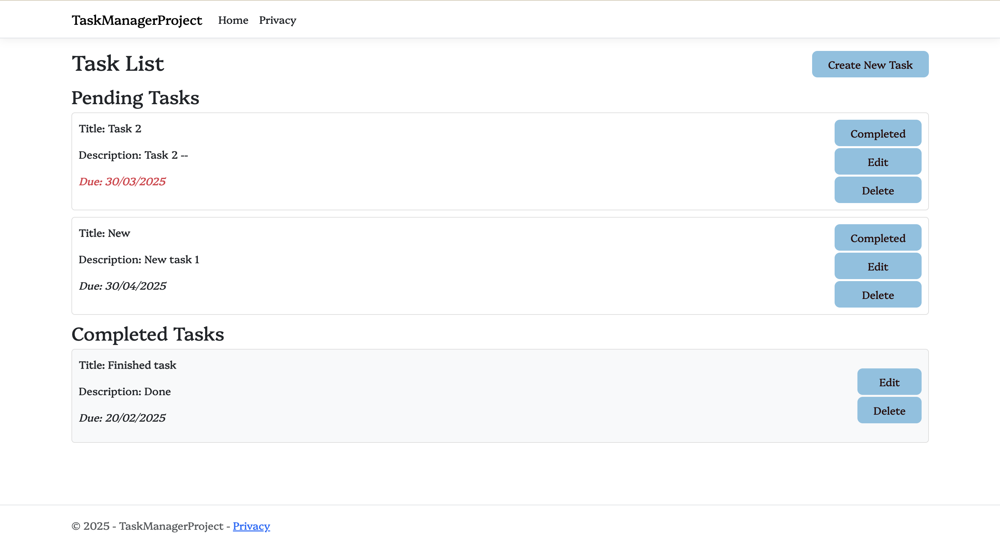

# Task Manager Project

## OVERVIEW
A simple Task Manager built with ASP.NET Core. The app allows users to create, manage, and track tasks.

## FEATURES
- Create new tasks with a title, description, and due date.
- Mark tasks as completed.
- Edit or delete tasks.
- View tasks catogorised by completion status and sorted by due date.

## PREREQUISITES
Before running the application locally, ensure the following are installed:

- NET 6 or later (for running the ASP.NET Core project)
- Visual Studio or VS Code

## HOW TO EXECUTE
1. Clone the repository to local machine:
```bash
git clone https://github.com/DlD27/Task-Manager-Project.git
cd Task-Manager-Project
```
2. Make sure .NET Core SDK is installed:
```bash
dotnet --version
```
3. Restore NuGet Packages:
```bash
dotnet restore
```
4. Apply Database Migrations:
```bash
dotnet ef database update
```
5. Run the Application:
```bash
dotnet run
```
6. Access the Application:
Open browser and navigate to: http://localhost:<port> (Replace `<port>` with the port number shown in the terminal)

## USAGE 
- Create a new task: Click on the "Create New Task" button to add a new task with a title, description, and due date.
- Mark a task as completed: Click the "Completed" button to mark a task as completed. It will be moved to the completed tasks section.
- Edit or Delete task: You can edit or delete tasks by using the respective buttons next to each task.

